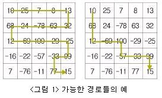
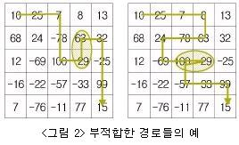

# 경로찾기
- 제한시간: 1000 ms
- 메모리제한: 64 MB

N × N 이차원 배열 A가 있고 A의 각 원소는 -100부터 100 사이의 임의의 정수 값을 갖는다. 이 이 차원 배열의 A[1][1]부터 시작하여 인접한 원소들을 방문해 가면서 A[N][N]에 이르는 경로를 선택하 려 하는데 아래와 같은 제약 조건이 있다.  

1. 위쪽으로는 이동할 수 없고 왼쪽, 오른쪽, 아래쪽으로만 이동할 수 있다.  
2. 한 번 방문한 원소는 다시 방문할 수 없다.  

 

이러한 제약을 만족하면서 임의의 경로를 따라 A[N][N]에 이르면 이 경로 상에 방문되었던 원소들의 값의 총합이 그 경로의 점수가 된다. 임의의 N × N 이차원 배열이 주어질 때, A[1][1]에서 A[N][N]에 이르는 경로 중 가장 점수가 높은 경로의 점수를 찾는 프로그램을 작성하시오.  

 
<그림 1>은 N=5인 경우 가능한 경로들의 예이다. 왼쪽 그림과 같이 원소들을 방문하는 경우 그 점수는 319가 되고, 오른쪽 그림과 같이 원소들을 방문하는 경우 그 점수는 145가 된다.

 

 

<그림 2>는 제약조건을 만족하지 못하는 경로들의 예이다. 첫 번째 예는 위쪽으로 이동함으로써 제약 조건을 어긴 것이고, 두 번째 예는 한 번 방문한 원소를 다시 방문함으로써 제약 조건을 만족하지 못한다.

 

 

 ## 입력 형식
첫째 줄에는 이차원 배열의 크기를 나타내는 정수 N(5≤N≤1,000)이 주어진다. 다음 N개의 줄에는 각각의 N개의 정수(-100이상 100이하)가 주어진다.
둘째 줄에 는 A[1][1]～A[1][N], 셋째 줄에는 A[2][1]～A[2][N], …… , N+1번째 줄에는 A[N][1]～A[N][N]의 값이 주어진다.

## 출력 형식
첫 번째 줄에 가장 점수가 높은 경로의 점수를 출력한다.

## 입력 예
5  
10 25 7 8 13  
68 24 -78 63 32  
12 -69 100 -29 -25  
-16 -22 -57 -33 99  
7 -76 -11 77 15  
  
## 출력 예
319  